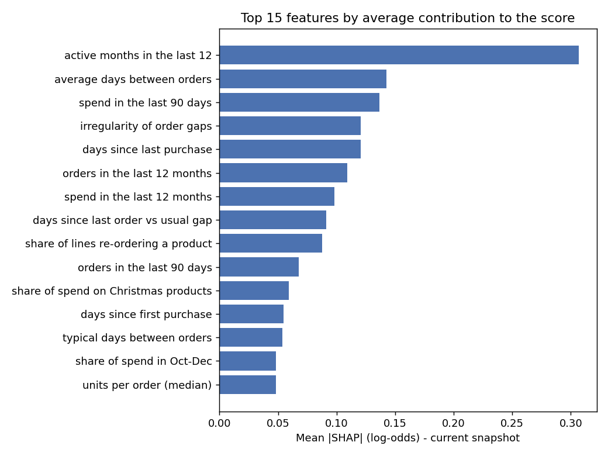
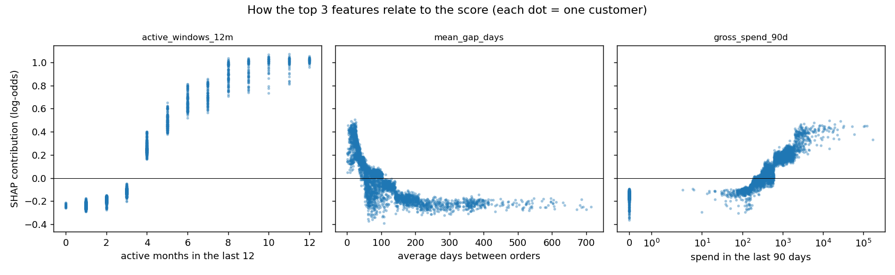
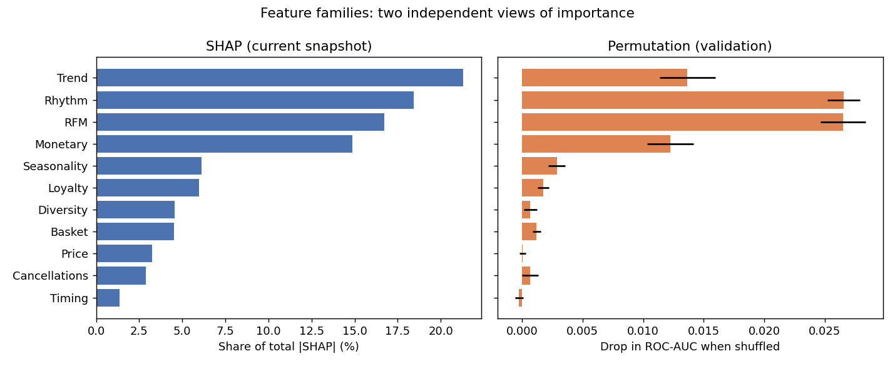

# Step 7 - Explainability

Model explained: `lightgbm` (chosen in Step 6). SHAP values are exact TreeSHAP values
computed by LightGBM (`pred_contrib=True`), in **log-odds**; for every customer
`base value (-0.256) + sum of contributions = model log-odds`
(max additivity error on the snapshot: 5.77e-15).

**How to read this.** A feature "raising the score" means the model associates that customer's
value with a higher probability of buying in the next 90 days, compared with the average
customer. These are associations learned from history, **not causes**: the model does not tell
us that changing a customer's behaviour, or contacting them, would change the outcome.
Correlated features (for example the three order-count windows) share credit, so the
family-level view is more reliable than any single feature.

**Seasonal context.** The calendar feature (`label_window_peak_share`) is the same for every customer at a
given cutoff, so it is not a customer characteristic. At the scoring cutoff the next 90 days are
off-season and it shifts every customer's log-odds by **-0.361**. It is
excluded from the rankings and driver lists below.

## Global drivers - top 15 customer-behaviour features
SHAP on the current snapshot (4,261 customers, cutoff 2011-12-10);
permutation importance on validation (4,324 customers, ROC-AUC 0.814);
`logreg_coef` = logistic-regression coefficient on the standardised (log) feature, as a cross-check
(sign should usually agree with `direction`; magnitudes are unstable under correlation).

| rank | feature | label | family | mean_abs_shap | direction | spearman_rho | perm_auc_drop | logreg_coef |
| --- | --- | --- | --- | --- | --- | --- | --- | --- |
| 1 | active_windows_12m | active months in the last 12 | Trend | 0.307 | higher value -> higher score | 0.952 | 0.014 | 0.513 |
| 2 | mean_gap_days | average days between orders | Rhythm | 0.142 | higher value -> lower score | -0.878 | 0.004 | -0.199 |
| 3 | gross_spend_90d | spend in the last 90 days | Monetary | 0.137 | higher value -> higher score | 0.950 | 0.005 | 0.034 |
| 4 | gap_cv | irregularity of order gaps | Rhythm | 0.121 | higher value -> lower score | -0.822 | 0.002 | -0.003 |
| 5 | recency_days | days since last purchase | RFM | 0.121 | higher value -> lower score | -0.962 | 0.010 | 0.034 |
| 6 | frequency_365d | orders in the last 12 months | RFM | 0.109 | higher value -> higher score | 0.845 | 0.001 | -0.002 |
| 7 | gross_spend_365d | spend in the last 12 months | Monetary | 0.098 | higher value -> higher score | 0.940 | 0.002 | -0.038 |
| 8 | overdue_ratio | days since last order vs usual gap | Rhythm | 0.091 | mixed / non-linear | 0.118 | 0.008 | -0.170 |
| 9 | repeat_sku_share | share of lines re-ordering a product | Loyalty | 0.088 | higher value -> higher score | 0.883 | 0.002 | 0.329 |
| 10 | frequency_90d | orders in the last 90 days | RFM | 0.068 | higher value -> higher score | 0.707 | 0.001 | 0.366 |
| 11 | christmas_share | share of spend on Christmas products | Seasonality | 0.059 | higher value -> lower score | -0.803 | 0.001 | -0.082 |
| 12 | tenure_days | days since first purchase | RFM | 0.055 | mixed / non-linear | 0.121 | 0.003 | -0.172 |
| 13 | median_gap_days | typical days between orders | Rhythm | 0.054 | higher value -> lower score | -0.828 | 0.002 | 0.050 |
| 14 | q4_spend_share | share of spend in Oct-Dec | Seasonality | 0.048 | higher value -> lower score | -0.732 | 0.001 | -0.015 |
| 15 | median_units_per_order | units per order (median) | Basket | 0.048 | mixed / non-linear | -0.125 | 0.001 | 0.009 |

Agreement between the two importance methods (Spearman correlation of feature ranks, SHAP vs
permutation): **0.82**.
Direction agreement between SHAP and logistic-regression signs (features with a clear
direction): **17 of 27**.

## Feature families
| family | n_features | shap_share | perm_auc_drop | perm_auc_drop_std |
| --- | --- | --- | --- | --- |
| Trend | 4 | 21.3% | 0.0137 | 0.0023 |
| Rhythm | 4 | 18.4% | 0.0266 | 0.0014 |
| RFM | 5 | 16.7% | 0.0265 | 0.0019 |
| Monetary | 3 | 14.9% | 0.0123 | 0.0019 |
| Seasonality | 2 | 6.1% | 0.0029 | 0.0007 |
| Loyalty | 1 | 6.0% | 0.0018 | 0.0005 |
| Diversity | 4 | 4.6% | 0.0007 | 0.0005 |
| Basket | 5 | 4.5% | 0.0012 | 0.0003 |
| Price | 2 | 3.2% | 0.0001 | 0.0003 |
| Cancellations | 2 | 2.9% | 0.0007 | 0.0007 |
| Timing | 1 | 1.4% | -0.0002 | 0.0003 |

## Per-customer drivers
For every customer in the snapshot, the 3 features raising and the 3 features lowering
their score are stored in `marts.customer_drivers` (with plain-language labels), and
family-level totals in `marts.customer_driver_families`. The profile engine (Step 8) reads
these tables.

## Limitations
- SHAP explains the model, not the world. If the model is wrong for a customer, so is the explanation.
- Correlated features split credit arbitrarily between them; use families for conclusions.
- Missing rhythm features (customers with too few orders) are handled natively by LightGBM;
  their SHAP value reflects "missing" as information (few repeat orders), not a measured gap.
- Permutation importance is measured off-season (validation). The calendar feature is constant
  there, so it cannot be measured this way; its effect is shown by the Step 6 ablation.
