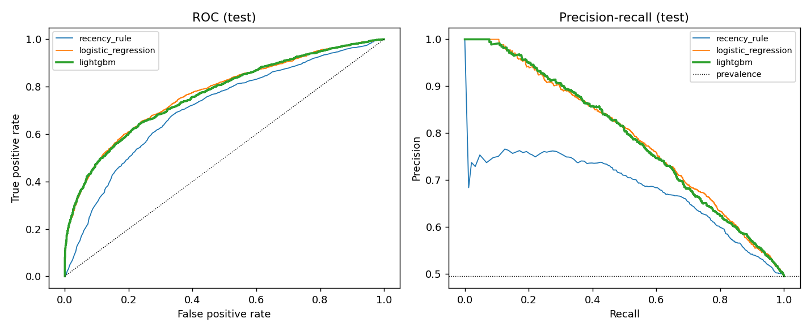
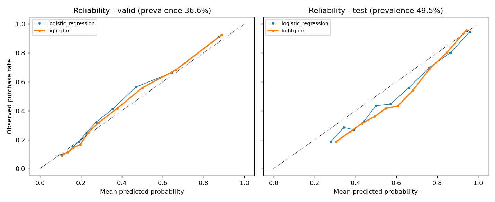

# Step 6 - Purchase-Propensity Model

## Question
For a customer who bought in the last 365 days, how likely is at least one purchase in the next
90 days? The score is a **model-estimated propensity** based on observed purchase
history. It describes association, not cause: a high score does not mean any feature *makes* the
customer buy.

## Design
| Item | Choice |
| --- | --- |
| Population | customers with >=1 purchase in the 365 days before the cutoff |
| Features | 34 = 33 SQL features (`customer_features(cutoff)`, rows strictly before the cutoff) + `label_window_peak_share` |
| Calendar feature | share of the 90-day label window falling in months [9, 10, 11]; known at the cutoff, so not leakage |
| Label | `purchased_in_horizon` from `purchase_labels(cutoff, 90)` |
| Split | time-based; train = stacked monthly cutoffs, valid and test = later single cutoffs |
| Excluded | `country` (audit only), `customer_id`, `cutoff_date` |
| Imbalance | positive rate 33-58% per cutoff -> no resampling, no class weights (they would distort probabilities); threshold tuned on valid instead |
| Tuned on | validation only. Test was scored once, after every choice was fixed |

### Split windows (label end is exclusive)
| split | first_cutoff | last_label_end |
| --- | --- | --- |
| train | 2010-06-01 | 2011-05-30 |
| valid | 2011-06-01 | 2011-08-30 |
| test | 2011-09-01 | 2011-11-30 |

## Model selection (validation)
- Logistic regression C = 1.0 (grid [0.01, 0.1, 1.0], chosen by valid ROC-AUC).
- LightGBM grid (valid ROC-AUC, early stopping on valid log loss):

| num_leaves | min_child_samples | best_iteration | valid_roc_auc |
| --- | --- | --- | --- |
| 15 | 50 | 353 | 0.814 |
| 15 | 200 | 347 | 0.814 |
| 31 | 50 | 212 | 0.814 |
| 31 | 200 | 195 | 0.813 |
| 63 | 50 | 166 | 0.812 |
| 63 | 200 | 172 | 0.812 |

- Rule: keep LightGBM only if it beats logistic regression on valid ROC-AUC by >= 0.005.
  Valid ROC-AUC: LightGBM 0.814 vs logistic 0.806
  -> **chosen model: `lightgbm`**.
- Calibration: Platt scaling, 5-fold CV Brier on valid 0.1614 vs raw 0.1619
  -> applied: **False**.
- Threshold: maximises F1 on valid -> **0.340**. Recency rule: "bought in the last 170 days".

## Results (valid and test)
Selection metrics were computed on valid; the test rows are the one-time held-out evaluation.
For the recency rule, calibration metrics do not apply ("-").

| split | model | roc_auc | pr_auc | precision_at_top20 | lift_at_top20 | brier | ece | mean_predicted | prevalence | precision | recall | f1 | selection_rate |
| --- | --- | --- | --- | --- | --- | --- | --- | --- | --- | --- | --- | --- | --- |
| valid | recency_rule | 0.746 | 0.592 | 0.661 | 1.805 | - | - | - | 0.366 | 0.512 | 0.823 | 0.631 | 0.588 |
| valid | logistic_regression | 0.806 | 0.746 | 0.788 | 2.152 | 0.166 | 0.038 | 0.343 | 0.366 | 0.612 | 0.741 | 0.670 | 0.444 |
| valid | lightgbm | 0.814 | 0.755 | 0.803 | 2.193 | 0.162 | 0.024 | 0.355 | 0.366 | 0.662 | 0.692 | 0.677 | 0.383 |
| test | recency_rule | 0.708 | 0.680 | 0.757 | 1.529 | - | - | - | 0.495 | 0.613 | 0.775 | 0.685 | 0.627 |
| test | logistic_regression | 0.770 | 0.791 | 0.874 | 1.764 | 0.200 | 0.082 | 0.577 | 0.495 | 0.510 | 0.989 | 0.673 | 0.960 |
| test | lightgbm | 0.767 | 0.789 | 0.880 | 1.776 | 0.207 | 0.106 | 0.599 | 0.495 | 0.525 | 0.967 | 0.681 | 0.912 |

Test uncertainty for `lightgbm` (bootstrap over customers, 500 reps):
ROC-AUC 95% CI [0.751, 0.779],
PR-AUC 95% CI [0.772, 0.803].

### Confusion matrix - test, threshold 0.340
|  | predicted: no purchase | predicted: purchase |
| --- | --- | --- |
| actual: no purchase | 310 | 1,872 |
| actual: purchase | 70 | 2,072 |

## Seasonality check (ablation on test)
Valid (Jun-Aug window) is off-season; test (Sep-Nov window) is peak season. The same model is
refitted without the calendar feature to show what the feature does. `mean_predicted` close to
`prevalence` means the overall level of the probabilities is right.

| variant | roc_auc | pr_auc | brier | ece | mean_predicted | prevalence |
| --- | --- | --- | --- | --- | --- | --- |
| lightgbm_with_calendar | 0.767 | 0.789 | 0.207 | 0.106 | 0.599 | 0.495 |
| lightgbm_without_calendar | 0.761 | 0.788 | 0.202 | 0.085 | 0.410 | 0.495 |

## Fairness / subgroup audit (test, country used for audit only)
Differences here are **descriptive**. The groups differ in size and behaviour; a gap in
selection rate is not by itself evidence of unfair treatment, but a gap in recall or
calibration at the same threshold would mean the score serves one group worse.

| group | n | prevalence | mean_predicted | roc_auc | pr_auc | selection_rate | recall | precision | false_positive_rate |
| --- | --- | --- | --- | --- | --- | --- | --- | --- | --- |
| UK | 3,937 | 0.493 | 0.597 | 0.765 | 0.787 | 0.909 | 0.965 | 0.523 | 0.854 |
| International | 387 | 0.525 | 0.621 | 0.777 | 0.813 | 0.946 | 0.985 | 0.546 | 0.902 |

## Why these metrics
| Metric | Why it is reported |
| --- | --- |
| ROC-AUC | Ranking quality independent of the base rate - important because valid (36.6%) and test (49.5%) prevalence differ. Used for model selection. |
| PR-AUC | Ranking quality focused on the buyers; compare against prevalence (its random baseline). |
| Precision@top-20% / lift | Matches how a campaign uses a score: contact the top slice. Robust to threshold choice. |
| Precision / recall / F1 at threshold | What happens if the score is turned into a yes/no flag. |
| Confusion matrix | Makes the error types concrete (wasted contacts vs missed buyers). |
| Brier, ECE, reliability curve, mean predicted | Whether "0.7" really means about 70% - needed because the profile engine shows probabilities to people. |

## Leakage checklist
- Features use `invoice_date < cutoff`; labels use `cutoff <= invoice_date < cutoff + 90` (SQL macros, tested for future-data invariance).
- Every train label window ends before the valid cutoff; the valid window ends before the test cutoff (checked in code, see table above).
- Preprocessing statistics (log/winsor/impute/scale) are learned on train only.
- The calendar feature uses only the calendar dates of the future window, not anything that happens in it.
- Residual risk: the same customer appears at several train cutoffs (correlated rows). This does not leak into valid/test, which are later in time, but it makes the train sample look larger than it is.

## Limitations
- One retailer, UK-centred, 2009-2011. Seasonality is learned from a single year (one peak season in train).
- Early train cutoffs have short history (data starts Dec 2009), so `tenure_days` is left-censored and the population at early cutoffs is younger.
- ~23% of transaction lines have no customer ID; those purchases are invisible to the model.
- Valid is off-season, so the calibration decision and threshold were chosen outside peak season; the test rows show how they carry over.
- Scores are associations useful for prioritising contact, not estimates of the effect of any action.
