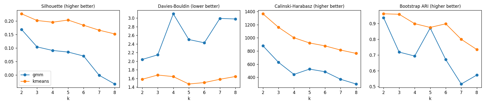
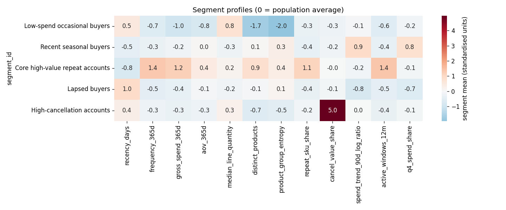
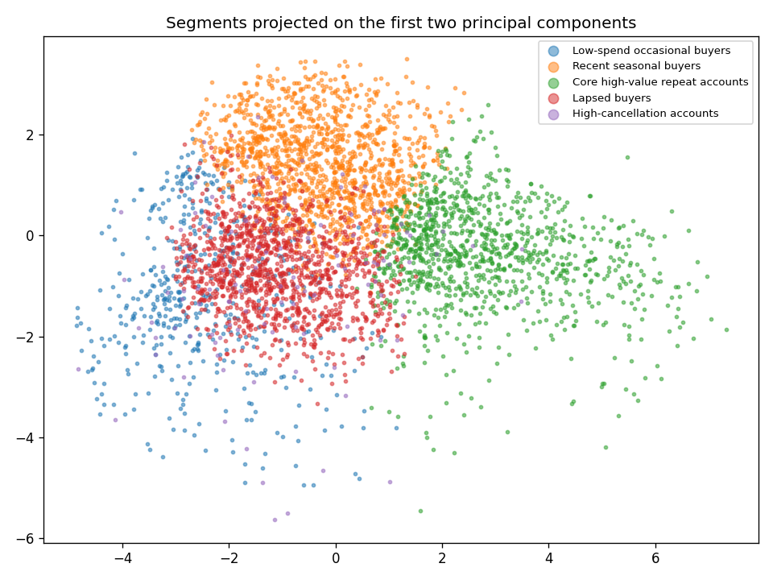

# Customer Segmentation

**Population:** 4,261 active customers (>=1 purchase in the 365 days before the last data date).  
**Features (12):** recency_days, frequency_365d, gross_spend_365d, aov_365d, median_line_quantity, distinct_products, product_group_entropy, repeat_sku_share, cancel_value_share, spend_trend_90d_log_ratio, active_windows_12m, q4_spend_share.  
**Preprocessing:** log1p on skewed features -> winsorise at 1%/99% -> median imputation -> standardisation.

## Model selection

Chosen: **kmeans with k = 5** (set manually in config.yaml).

| method | k | silhouette | davies_bouldin | calinski_harabasz | bic | min_cluster_share | stability_ari |
| --- | --- | --- | --- | --- | --- | --- | --- |
| kmeans | 2 | 0.23 | 1.58 | 1,365.89 |  | 0.37 | 0.96 |
| gmm | 2 | 0.17 | 2.04 | 879.52 | 66,429.24 | 0.43 | 0.94 |
| kmeans | 3 | 0.20 | 1.68 | 1,161.47 |  | 0.29 | 0.96 |
| gmm | 3 | 0.10 | 2.15 | 628.61 | 53,108.83 | 0.16 | 0.72 |
| kmeans | 4 | 0.20 | 1.64 | 1,002.01 |  | 0.12 | 0.90 |
| gmm | 4 | 0.09 | 3.10 | 443.65 | 28,248.90 | 0.13 | 0.69 |
| kmeans | 5 | 0.20 | 1.47 | 922.30 |  | 0.03 | 0.88 |
| gmm | 5 | 0.09 | 2.50 | 524.38 | 25,794.25 | 0.10 | 0.87 |
| kmeans | 6 | 0.18 | 1.50 | 877.90 |  | 0.03 | 0.90 |
| gmm | 6 | 0.07 | 2.43 | 484.47 | 29,393.64 | 0.05 | 0.67 |
| kmeans | 7 | 0.17 | 1.58 | 814.40 |  | 0.03 | 0.80 |
| gmm | 7 | -0.00 | 2.99 | 369.77 | 21,692.30 | 0.05 | 0.52 |
| kmeans | 8 | 0.15 | 1.65 | 763.87 |  | 0.03 | 0.73 |
| gmm | 8 | -0.03 | 2.98 | 297.62 | 15,891.47 | 0.03 | 0.57 |

**HDBSCAN diagnostic** (min cluster size 50): 3 dense clusters, 83.9% of customers labelled noise. A large noise share means the data has no sharp density-separated groups, so partitioning methods (K-Means/GMM) are appropriate.

## Segment profiles (medians)

| segment_id | segment_name | n_customers | pct_customers | pct_revenue_365d | recency_days | frequency_365d | gross_spend_365d | aov_365d | median_line_quantity | distinct_products | product_group_entropy | repeat_sku_share | cancel_value_share | spend_trend_90d_log_ratio | active_windows_12m | q4_spend_share | tenure_days | frequency_total | gross_spend_total | median_gap_days |
| --- | --- | --- | --- | --- | --- | --- | --- | --- | --- | --- | --- | --- | --- | --- | --- | --- | --- | --- | --- | --- |
| 0 | Low-spend occasional buyers | 487 | 11.40 | 2.50 | 106.00 | 1.00 | 183.44 | 145.05 | 12.00 | 7.00 | 0.69 | 0.00 | 0.00 | 0.00 | 1.00 | 0.13 | 262.00 | 2.00 | 256.32 | 103.50 |
| 1 | Recent seasonal buyers | 1,354 | 31.80 | 12.30 | 27.00 | 2.00 | 598.06 | 289.94 | 6.00 | 58.00 | 1.76 | 0.10 | 0.00 | 5.85 | 2.00 | 0.66 | 403.00 | 3.00 | 981.63 | 96.00 |
| 2 | Core high-value repeat accounts | 1,071 | 25.10 | 72.00 | 17.00 | 7.00 | 2,740.03 | 365.79 | 10.00 | 162.00 | 1.79 | 0.41 | 0.01 | 0.43 | 6.00 | 0.34 | 656.00 | 13.00 | 5,032.22 | 37.00 |
| 3 | Lapsed buyers | 1,234 | 29.00 | 8.60 | 173.00 | 1.00 | 408.48 | 270.27 | 6.00 | 47.00 | 1.64 | 0.10 | 0.00 | 0.00 | 1.00 | 0.00 | 488.00 | 3.00 | 870.56 | 91.00 |
| 4 | High-cancellation accounts | 115 | 2.70 | 4.60 | 79.00 | 2.00 | 450.30 | 245.31 | 10.00 | 25.00 | 1.43 | 0.11 | 0.24 | 0.00 | 2.00 | 0.27 | 442.00 | 3.00 | 908.35 | 97.00 |

## Audit: segment mix by market (country is NOT a clustering feature)

% of each market's customers in each segment.

| segment_id | International | UK |
| --- | --- | --- |
| Low-spend occasional buyers | 9.50 | 11.60 |
| Recent seasonal buyers | 27.80 | 32.20 |
| Core high-value repeat accounts | 28.80 | 24.70 |
| Lapsed buyers | 30.20 | 28.80 |
| High-cancellation accounts | 3.70 | 2.60 |

Segment names describe observed purchasing behaviour only; they make no claims about customers' motives or personality.
